  

  

  
  

---

<h2 align="center">𝐒𝐞𝐚𝐬𝐨𝐧 𝐎𝐧𝐞</h2>

<i>The making of a Generative AI engineer, told in the order it actually happened.</i>

### 𝐏𝐫𝐨𝐥𝐨𝐠𝐮𝐞: The quiet first scene
Every origin story has a quiet first scene, and mine has no background music. It is a Computer Science student in Raichur, Karnataka, with a laptop, a lot of curiosity, and one stubborn question: *what would it take to build the kind of AI everyone is talking about?*

### 𝐀𝐜𝐭 𝐈: The unglamorous foundations
Nobody films this part, so I will describe it. Python, statistics and linear algebra, studied until they stopped feeling like subjects and started feeling like tools. The proof lives in [30-days-python-journey](https://github.com/rahmann292006-netizen/30-days-python-journey): thirty days, one problem at a time, no shortcuts.

### 𝐀𝐜𝐭 𝐈𝐈: Learning out loud
At some point I decided to stop learning in private. [AI-Engineer-Journey](https://github.com/rahmann292006-netizen/AI-Engineer-Journey) is where I document the path in public: what I study, what I build, what breaks. It keeps me honest, and it is the diary I wish I had found earlier.

### 𝐀𝐜𝐭 𝐈𝐈𝐈: Building things that run
Notes are good. Software that runs is better.
- **[Fitzy](https://github.com/rahmann292006-netizen/Fitzy-AI-Fitness-App)**: an AI-powered fitness and wellness app built with Flutter and Firebase.
- **[WeatherGPT](https://github.com/rahmann292006-netizen/WeatherGPT)**: a weather assistant that talks back.
- **[portfolio](https://github.com/rahmann292006-netizen/portfolio)**: my corner of the web, built with React, Vite and Framer Motion.

### 𝐓𝐡𝐞 𝐩𝐥𝐨𝐭 𝐭𝐡𝐢𝐜𝐤𝐞𝐧𝐬
Right now the work is machine learning and data structures, side by side. The projects are getting more ambitious, and so are the questions.

| Now | Next | By 2028 |
|:---:|:---:|:---:|
| Machine learning and data structures | Deep learning and GenAI applications | Generative AI engineer |

### 𝐍𝐞𝐱𝐭 𝐞𝐩𝐢𝐬𝐨𝐝𝐞
If you build with AI, hire for it, or just want to compare notes, say hello on [LinkedIn](https://www.linkedin.com/in/abdul-rahman-75366b343/) or [X](https://x.com/rahman_aibuilds). The next chapter is being written in the commits below.

---

<h2 align="center">𝐓𝐡𝐞 𝐭𝐨𝐨𝐥𝐤𝐢𝐭</h2>

  
  
  
  
  
  
  
  
  
  

<h2 align="center">𝐒𝐞𝐥𝐞𝐜𝐭𝐞𝐝 𝐰𝐨𝐫𝐤</h2>

  
  

  
  

<h2 align="center">𝐓𝐡𝐞 𝐫𝐞𝐜𝐨𝐫𝐝</h2>

  
  

  

  <picture>
    <source media="(prefers-color-scheme: dark)" srcset="https://raw.githubusercontent.com/rahmann292006-netizen/rahmann292006-netizen/output/snake-dark.svg">
    
  </picture>

<i>Thanks for reading. See you in the next commit.</i>

